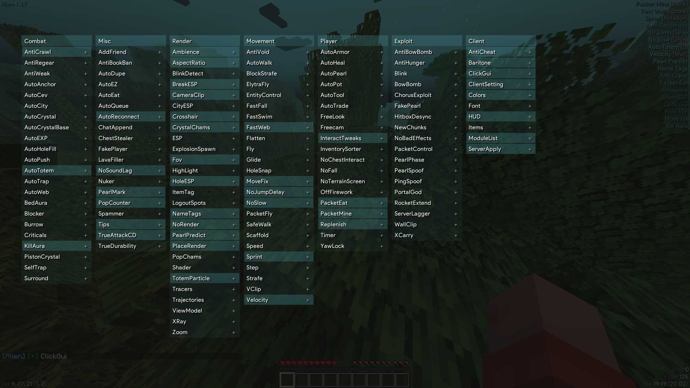

## AlienClient
no rat here

now Alien v2(mc1.21.1) is free but not open source

I will maintains Alien v2

You can report bugs or request changes(Open Issues)

##
- Minecraft version **```Fabric 1.20.4```**
- Default ClickGui KeyBind **```Y```**
- Default Prefix **```;```**

<details>
<summary>Supported Servers</summary>
  
- 2b2t.xin
- 2b2tpvp.cn
- 3c3u.org
- 2b2tpvp.net
- crystalpvp.cc
- and servers with NoCheatPlus or Grim AntiCheat
</details>

<details>
<summary>ScreenShot</summary>
  

</details>

## License
GNU General Public License v3.
## Credits
- https://github.com/coltonk9043/Aoba-MC-Hacked-Client
- https://github.com/qualterz/lookaround
- https://github.com/Pan4ur/ThunderHack-Recode
- https://github.com/Ladysnake/Satin
- https://github.com/MeteorDevelopment/meteor-client
- https://github.com/cabaletta/baritone
- https://github.com/The-Fireplace-Minecraft-Mods/In-Game-Account-Switcher
